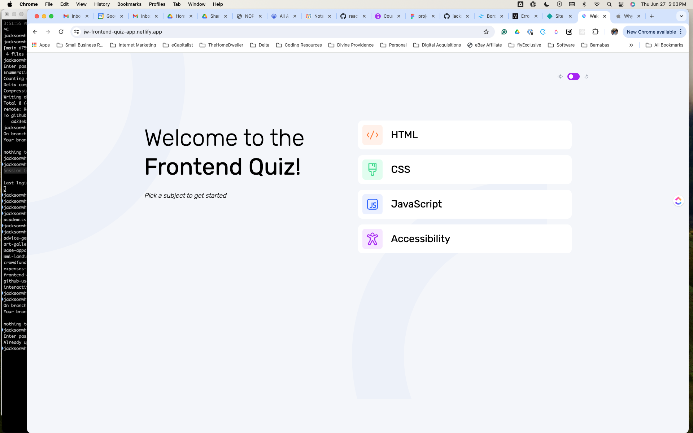

# Frontend Quiz App

## Table of contents

- [Overview](#overview)
  - [The challenge](#the-challenge)
  - [Screenshot](#screenshot)
  - [Links](#links)
- [My process](#my-process)
  - [Built with](#built-with)
  - [What I learned](#what-i-learned)
  - [Continued development](#continued-development)
  - [Useful resources](#useful-resources)
- [Author](#author)
- [Acknowledgments](#acknowledgments)

## Overview

### The challenge

Users should be able to:

- Select a quiz subject
- Select a single answer from each question from a choice of four
- See an error message when trying to submit an answer without making a selection
- See if they have made a correct or incorrect choice when they submit an answer
- Move on to the next question after seeing the question result
- See a completed state with the score after the final question
- Play again to choose another subject
- View the optimal layout for the interface depending on their device's screen size
- See hover and focus states for all interactive elements on the page
- Navigate the entire app only using their keyboard
- **Bonus**: Change the app's theme between light and dark

### Screenshot

### Links

- Solution URL: [Github Repository](https://github.com/jacksonwhiting/frontend-quiz-app)
- Live Site URL: [Live Site](https://jw-frontend-quiz-app.netlify.app/)

## My process

### Built with

- Semantic HTML5 markup
- CSS custom properties
- Flexbox
- CSS Grid
- Mobile-first workflow
- Tailwind CSS
- [Qwik](https://qwik.dev/) - JS library

### What I learned

This was my first time using Qwik. I love the concept and the developer experience is quite a bit nicer than React. It was great using Signals for State Management. I'll be interested to see how this develops.

### Continued development

I wanted to give Qwik a shot to see if it's something I wanted to use for personal projects but I plan on learning React for future development.

## Author

- Frontend Mentor - [@jacksonwhiting](https://www.frontendmentor.io/profile/jacksonwhiting)
- Twitter - [@JWhiting00](https://www.twitter.com/JWhiting00)
